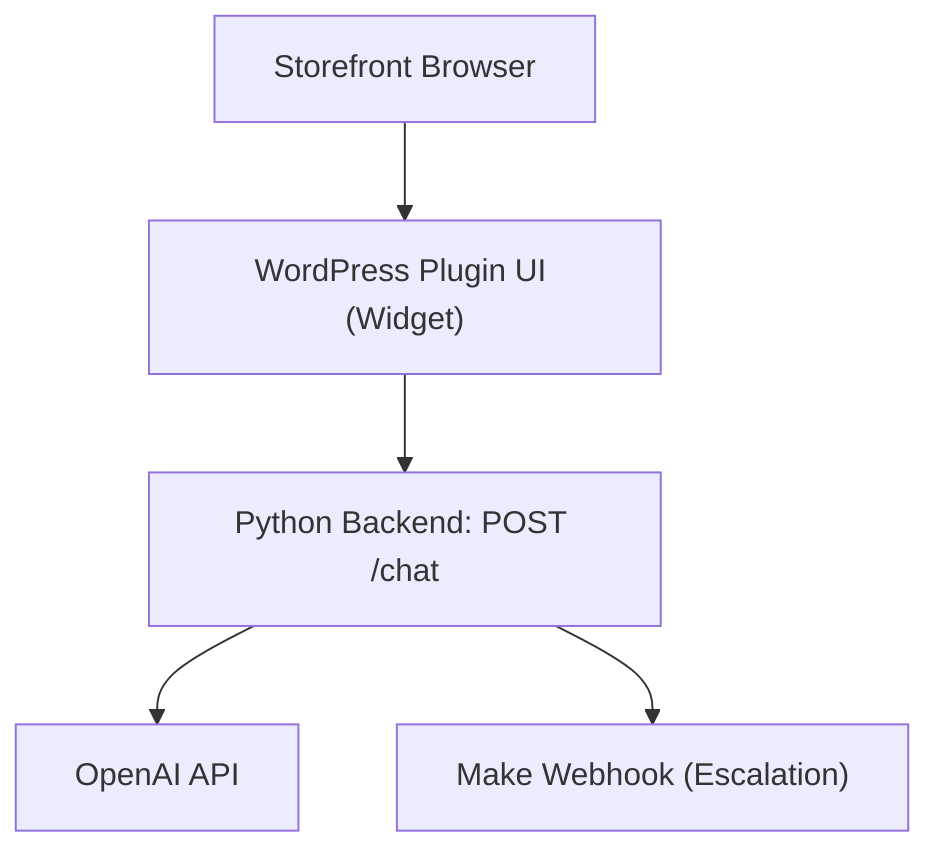

## 1. Product Overview
An AI customer support system for WooCommerce sites consisting of:

- A **WordPress plugin (UI only)** that renders a floating chat widget and sends messages to a backend.
- A **Python backend (system brain)** that performs all AI logic, calls OpenAI, detects escalation, and triggers Make automation.
- **Make.com (automation layer)** that receives escalation webhooks and runs email/Sheets/Slack workflows.

No database for now.

## 2. Core Features

### 2.1 User Roles
| Role | Registration Method | Core Permissions |
|------|---------------------|------------------|
| Shopper (guest or logged-in) | None (guest) or existing WooCommerce account | Can chat and optionally submit escalation contact details |
| Store Admin | Existing WordPress admin user | Can configure backend URL and enable/disable widget |

### 2.2 Feature Modules
1. **Storefront Chat Widget**
   - Open/close widget, message stream, send messages.
   - Displays AI reply.
   - If escalation is detected, shows an escalation form (name/email + optional note).
2. **Plugin Settings (WP Admin)**
   - Menu: **Chatbot Ecom**.
   - Settings: Backend API URL, Enable/Disable toggle.

## 3. Core Process

### 3.1 Shopper Flow
1. Shopper opens the chat widget and sends a message.
2. The widget sends the message to the Python backend `POST /chat`.
3. Python calls OpenAI and generates a reply.
4. Python detects escalation conditions (human request, refund, angry message).
5. If escalation is detected:
   - Python triggers a Make webhook (server-to-server).
   - The response includes `escalation: true` so the widget can show the escalation form.

### 3.2 Admin Flow
1. Admin opens WordPress admin → **Chatbot Ecom**.
2. Admin configures Backend API URL and enables/disables the widget.

## 4. Non-Goals (Now)
- No database / ticket storage in the backend.
- No order management changes.
- No AI processing in WordPress.

