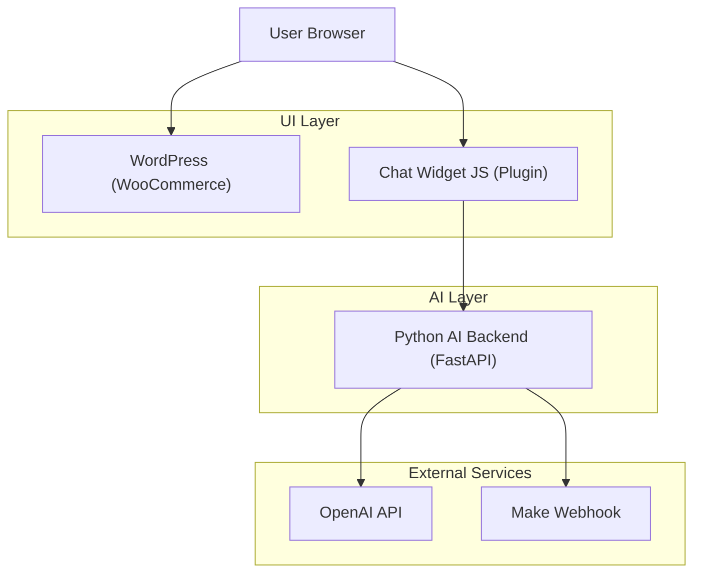

## 1. Architecture Design



## 2. Technology
- Backend: Python + FastAPI
- AI: OpenAI API
- Automation: Make.com incoming webhook
- WordPress: plugin for Admin settings + storefront widget assets
- Database: none (stateless backend)

## 3. Backend API

### 3.1 `POST /chat`
Purpose: generate an AI reply and detect escalation.

Request (example shape):
```json
{
  "message": "I want a refund",
  "session_id": "optional-client-generated",
  "transcript": [{"role": "user", "content": "..."}]
}
```

Response:
```json
{
  "reply": "I can help with that...",
  "escalation": true,
  "escalation_reason": "refund_request"
}
```

### 3.2 Escalation webhook to Make
When escalation is detected, the backend sends a webhook payload to Make including:
- `session_id`
- shopper message + transcript
- detected reason (human request / refund / angry)
- optional contact details when provided by the widget

## 4. Production Considerations
- CORS: backend must allow your storefront origin (or provide an optional WordPress server-side proxy later).
- Secrets: OpenAI key and Make webhook URL are stored only in backend environment variables.
- Observability: structured logs per request; do not log secrets.

